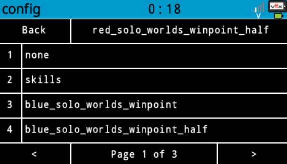

# 80550F

Codebase for team 80550F and the Over Under Season.
**Robot code is located in `src/comp.py`.** Because VEX only lets us download one user file (in python) onto the brain, its a big thousand line file divided into a bunch of classes (mostly arbitrarily organized) to *try* and help with this limitation.

Big stuff:
- `Autonomous` class manages all the autons, including setup, execution of the sequence, and cleanup. Also contains the main logic of the `path` function for driving paths with pure pursuit
  - `PurePursuit` contains all the math involved with pure pursuit. Similar logic found on the Purdue SigBots wiki but expanded throughout the year. This is *just* the algorithm, most of the logic is in `Autonomous.path()`.
    - Check the gif in `resources/pure_pursuit.gif` for a visual on the algorithm
    - 
  - `Autonomous.path()` is a blocking command used to run a path of points. No arguments are needed except for the list of points. 
  - `main()` on line 1494 is the actual entry point for the code. It basically sets up the robot object and then determines:
    - if connected to a field, run no tests and setup everything for a match
    - elif we want to test autonomous, run `Autonomous.test()`
    - else run `Driver.run()`
  - `Driver` class handled driver stuff, should actually be pretty readable. Most subsystems have their own control functions that all come together in `driver_loop()`

Other things:
- download_selector.py is a vscode task that changes the download format json to select different programs
- config.json (`autons/config.json`) contains persistent autonomous selection which is setup in `src/config.py`.
Configuration program (`config.py`):
    
- `src/driver.py` is essentially a stripped down version of `comp.py` such that there is no autonomous logic or competition variable, it just goes straight into `Driver.run()`. This helps in matches in case the auton doesn't work or the brain power cycles. Switching a program during a match is sketchy (and stopping auton early by stopping the program is a DQ) but if it breaks or power cycles this can be a life saver.
